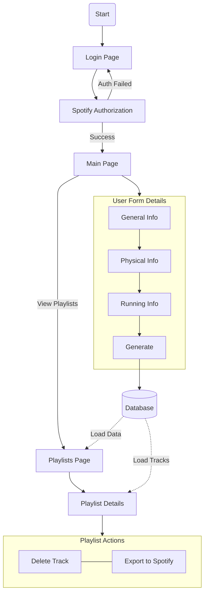
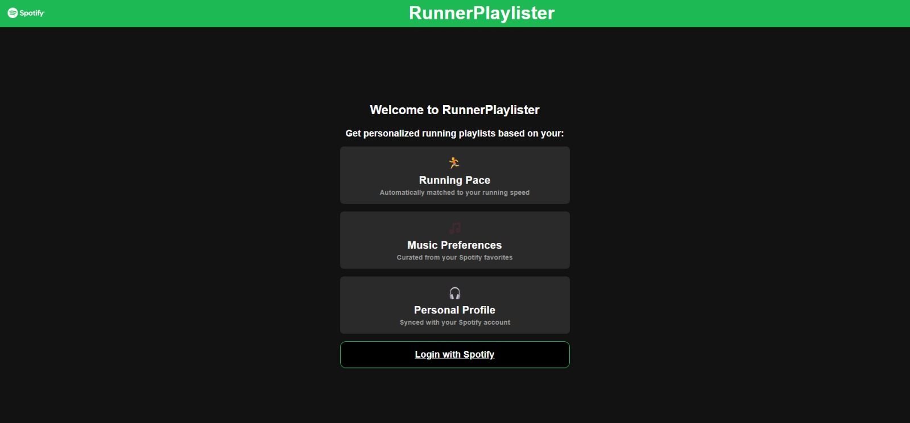
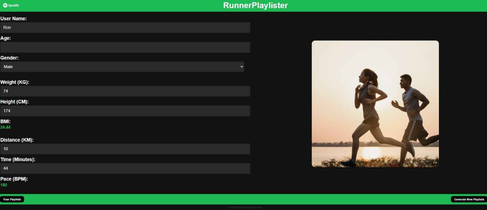
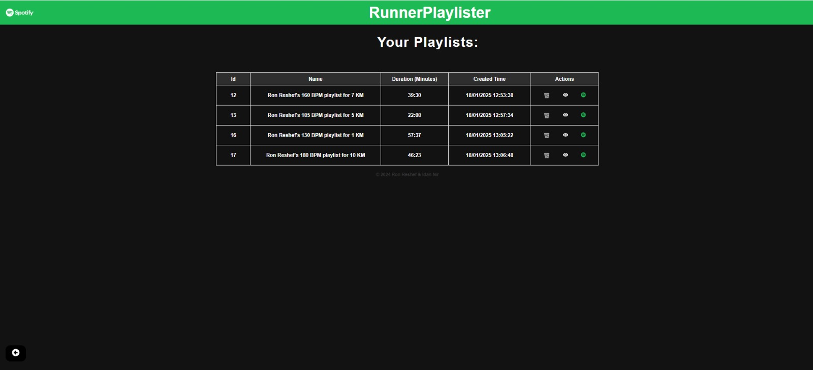
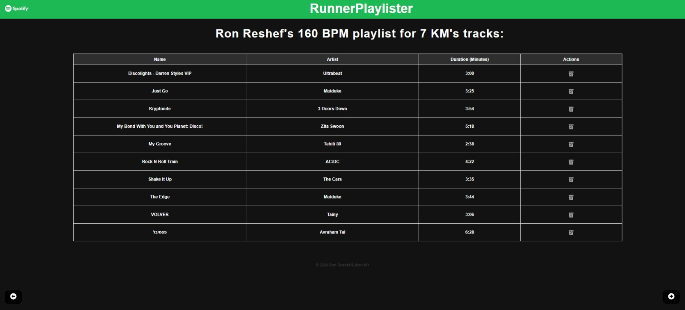

# RunnerPlaylister


RunnerPlaylister is a web application that creates personalized Spotify playlists matched to your running pace. By analyzing your running metrics and Spotify preferences, it generates the perfect soundtrack for your workout, ensuring the music's tempo matches your running rhythm.

## Table of Contents

- [Project Introduction](#runnerplaylister)
- [Features](#features)
- [Quick Start](#quick-start)
  - [Prerequisites](#prerequisites)
  - [Setup Instructions](#setup-instructions)
- [Application Flow](#application-flow)
- [pics](#pics)
- [Project Structure](#project-structure)

## Features

- **Spotify Integration**
  - Secure OAuth authentication
  - Direct playlist export to Spotify
  - Integration with user's music preferences

- **Running Analysis**
  - BPM (Beats Per Minute) calculation based on pace
  - Distance and duration tracking
  - BMI calculation and tracking

- **Playlist Management**
  - Create custom playlists based on running parameters
  - View and manage existing playlists
  - Remove individual tracks
  - Export playlists to Spotify account

## Quick Start

### Prerequisites

- Python 3.x
- Node.js and npm
- Spotify Developer Account
- Git

### Setup Instructions

1. **Clone Repositories**
```bash
git clone https://github.com/ReshefRon/runner-playlister-frontend.git
git clone https://github.com/ReshefRon/runner-playlister-backend.git
```

2. **Backend Setup**
```bash
cd runner-playlister-backend

# Install dependencies
pip install -r requirements.txt

# Create .env file with:
SPOTIFY_CLIENT_ID=your_client_id
SPOTIFY_CLIENT_SECRET=your_client_secret
SPOTIFY_REDIRECT_URI=http://localhost:1998/callback

# Initialize database
python db_init.py

# Run server
python flask_server.py
```

3. **Frontend Setup**
```bash
cd runner-playlister-frontend

# Install dependencies
npm install

# Create .env file with:
REACT_APP_BACKEND_URL=http://localhost:1998

# Start application
npm start
```

## Application Flow

### System Architecture
The following diagram illustrates the complete application flow:



### Application Screens

1. **Login and Authentication**

- Spotify OAuth integration
- Feature overview display

2. **Main Page**

- User metrics input
- Running parameters
- Automatic BMI and pace calculation

3. **Playlists Management**

- View all generated playlists
- Export to Spotify functionality
- Playlist management options

4. **Playlist Details**

- Track listing and management
- Duration information
- Individual track controls

## Project Structure

### Backend Components
- `flask_server.py` - Core server application and route handling
- `db_functions.py` - Database operations and management
- `spotify_fetcher.py` - Spotify API integration and track fetching
- `Database/` - SQLite database files
- `requirements.txt` - Python dependencies

### Frontend Components
- `src/`
  - `components/` - Reusable React components
  - `pages/` - Main application pages
  - `styles/` - CSS styling files
  - `App.js` - Main application component
  - `index.js` - Application entry point

## API Endpoints

- `GET /` - Spotify authentication
- `GET /callback` - OAuth callback handling
- `POST /generate-playlist` - Create new playlist
- `GET /get_playlists_data` - Retrieve user's playlists
- `DELETE /remove_playlist` - Delete playlist
- `POST /get_playlists_tracks` - Get playlist tracks
- `DELETE /remove_track` - Remove track from playlist

## Environment Variables

### Backend (.env)
```
SPOTIFY_CLIENT_ID=your_spotify_client_id
SPOTIFY_CLIENT_SECRET=your_spotify_client_secret
SPOTIFY_REDIRECT_URI=http://localhost:1998/callback
```

### Frontend (.env)
```
REACT_APP_BACKEND_URL=http://localhost:1998
```

© 2024 Ron Reshef & Idan Nir
